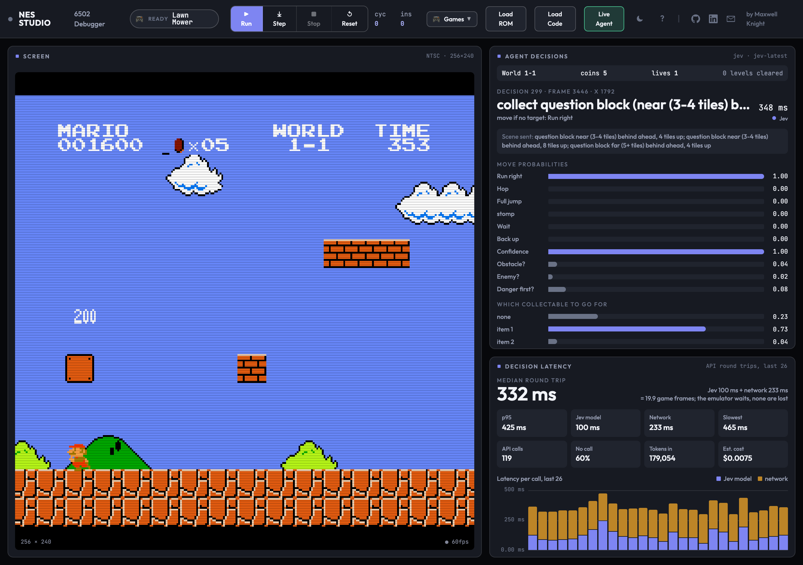

# Mario and Jev

Super Mario Bros, played by [TypeSafe](https://docs.typesafe.ai)'s **Jev** model, live in
your browser.

Jev is not a chat model. You send it a *state* and typed *questions* (a Choice, a Score,
a yes/no "Noul") and it returns probabilities, in about 100 ms, for a fraction of a cent.
This project puts that in front of a real NES: the emulator reads the game's RAM, code
turns it into a short description of the scene, Jev decides what Mario should do, code
turns the decision into buttons, and NES Studio shows the decision, its probabilities and
how long it took while Mario plays.



## How a decision is made

```
NES RAM ──► smb_state.py ──► scene (JSON) ──► Jev ──► answers ──► jev.py ──► buttons
            tile buffer,      "pipe 2 tiles      Choice: move        probabilities,    run, hop,
            enemy slots,       high, close       Choice: target      confidence        full jump,
            player state       ahead; goomba     Noul: danger                          stomp, seek
                               very close"        first?                               under a block
```

A few times a second, while Mario is on the ground, one request goes to Jev with the
scene and three or four questions:

| Question | Type | What it decides |
|---|---|---|
| `move` | Choice | `run_right`, `hop`, `full_jump`, `stomp`, `wait`, `back_up` |
| `target` | Choice | which of the coins / ? blocks / coin bricks in view to go for, or `none` |
| `hazard_first` | Noul | must a danger be dealt with before stopping to collect? |
| `obstacle_needs_jump`, `enemy_needs_jump` | Noul | read only when `move` comes back with low confidence |

The split follows TypeSafe's own advice: Jev is asked for *judgements*, everything
numeric stays in code. Jev is weak at arithmetic and reads instructions literally, so:

- **Scene text is bucketed words**, not numbers: "very close (1 tile)", "same height as
  Mario", "a ? block with a coin inside, 4 tiles above the ground".
- **Jump geometry is code.** A measured jump table (A held 16 frames from a standstill
  = 3.4 tiles), frame-by-frame positioning under a block, climbing onto a ledge for a
  block that is too high, launch points for floating coins.
- **Enemies at Mario's height are code too** (`Player._enemy_maneuver`): brake, wait,
  jump straight up when the enemy is 1.3 tiles away so it passes underneath (measured),
  a running hop when there is no room to brake, a full jump for koopas and pairs, and a
  headroom check because World 1-2 has overhangs where no jump is possible.
- **Invariants stay in code** whatever Jev says: no collecting with a pit two tiles
  ahead or an enemy in view, no jump until its reason is within reach, hold still
  through a block jump.
- **No call when none is needed**: an empty scene is `run_right`, and a scene identical
  to one already answered reuses the answer.

The agent plays whole games: through the flagpole into the next level, through a death
into the next life, until game over. Every decision is logged (`logs/*.jsonl`) with the
scene, the answer, the probabilities and the latency.

## Setup

You need a C++17 compiler and CMake for the core, Python 3.10+, Node 20+ with pnpm for
the web app, a Super Mario Bros ROM (not included) and a TypeSafe API key from
[console.typesafe.ai](https://console.typesafe.ai/keys).

```bash
# 1. the headless core the Python package drives
cmake -B native_build -DCMAKE_BUILD_TYPE=Release
cmake --build native_build --target nesenv

# 2. the API key (.env is gitignored)
echo 'TYPESAFE_API_KEY=...' > .env

# 3. the web app; the WASM core it needs is built with Docker (see docs/EMULATOR.md)
docker compose run --rm dev build_wasm.sh
cd web && pnpm install && cd ..
```

The ROM can be plain *Super Mario Bros* or the *SMB / Duck Hunt / Track Meet* multicart;
the agent taps Start through either menu.

## Run it

**Watch Jev play, live:**

```bash
PYTHONPATH=python python3 -m nesenv.live "Super Mario Bros.nes" --agent jev --port 8000
VITE_LIVE_AGENT_URL=http://localhost:8000/stream pnpm --dir web dev
```

Open the dev server and click **Spawn Agent**. The debugger panels give way to an agent
view: a large screen, the current decision (the scene text that was sent, the move, the
move and target probabilities, confidence, a decision log) and a latency panel (median
and p95 round trip split into Jev's own time and network time, tokens, estimated cost, a
per-call latency chart, and how each life ended). Click the button again to disconnect;
every open tab runs its own agent and its own API calls.

**Record a game to a movie** (replayable in NES Studio, with a `.jsonl` decision log):

```bash
cd python
PYTHONPATH=. python3 examples/jev_agent.py "Super Mario Bros.nes" jev.nesmovie
```

**No key yet?** The same harness runs with an offline rule-based policy, useful for
testing the code side:

```bash
PYTHONPATH=python python3 -m nesenv.live "Super Mario Bros.nes" --agent heuristic
PYTHONPATH=. python3 examples/jev_agent.py "Super Mario Bros.nes" out.nesmovie --policy heuristic
```

The emulator only advances when it is stepped, so API latency never costs Mario a frame;
it only slows the live stream down.

## What it does today

Numbers from `jev-1.13.0`, September 2026, on this machine:

- Round trip to Jev is typically 330-400 ms, of which Jev itself is 70-120 ms; the rest
  is network from here. Occasional 2-6 s spikes come from outside Jev.
- About 1,400 input tokens per call; a whole game (three lives) costs $0.01-0.02.
- Jev clears World 1-1 most games, usually with 5-15 coins, and gets a fair way into
  1-2 before running out of lives. It does not yet collect every coin: with an enemy
  in view collecting is skipped, and pipe bonus rooms are not entered.

The decision log is the place to look when Mario dies. Each line has the scene Jev saw,
what it answered, what the code actually did and why (`action`, `enemy_maneuver`,
`early_jump_held`, `hop_upgraded`), so a death traces back to a wording in the
questions or a rule in the code.

## Tuning it

Everything Jev is told lives at the top of [`python/nesenv/jev.py`](python/nesenv/jev.py):
`MOVE_CRITERIA`, `BASE_QUESTIONS`, `TARGET_QUESTION`, the confidence thresholds and the
measured jump constants. The scene vocabulary is in
[`python/nesenv/smb_state.py`](python/nesenv/smb_state.py). Change a description, rerun,
diff the logs.

Two habits that paid off: name the exact condition in the criteria (Jev answers the
question you wrote, not the one you meant; "a ledge that drops is not a pit" had to be
said), and when a wrong answer is really a geometry problem, move it into code rather
than into the prompt.

## Layout

```
python/nesenv/smb_state.py   RAM -> scene description
python/nesenv/jev.py         questions, Jev client, collect planner, enemy maneuver, Player
python/nesenv/live.py        SSE server: frames + agent/decision/outcome events, logs/
python/examples/jev_agent.py record a game
web/src/components/AgentPanels.tsx   decision and latency panels
web/src/emulator/EmulatorProvider.tsx  live-agent stream handling
docs/EMULATOR.md             the emulator itself (upstream README)
```

## Credits and license

Built on Maxwell Knight's [nes-emulator](https://github.com/MaxwellKnight/nes-emulator):
the C++ core, NES Studio and the `nesenv` Python package are his; see
[`docs/EMULATOR.md`](docs/EMULATOR.md). Jev is [TypeSafe](https://typesafe.ai)'s model.
GPL v3, see [LICENSE](LICENSE).
